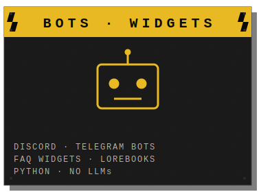

  

 

I'm a 50-year-old ex-mariner from Denmark. Years on Danish-flagged
vessels — navigator and deckhand on supply ships, rescue vessels,
and hopper dredgers. Now I'm learning to build software.

I study front-end through **#100Devs** and build things one project
at a time. I'm not a software engineer. But I build, I
learn fast, and I care about the work landing right.

AuDHD brain. Clear lanes or nothing gets done.

 

Everything lives under one username, but the work splits into three
so I (and you) can actually find things:

<table>
<tr>
<td width="33%" align="center"></td>
<td width="33%" align="center"></td>
<td width="33%" align="center"></td>
</tr>
</table>

 

Bots and automation are paid work. Prices are low — bots typically
**$10–13**, automation depends on scope. 

Other things I can help with: data entry, code tasks, and
Danish/Swedish/Norwegian translation. Also Danish voice work — I
carry both a North Zealand and a Jutland accent. Long story.

 

Reach me here on GitHub. Open an issue on any repo, or DM me. Danish, English, Norwegian, or Swedish all work.

 

