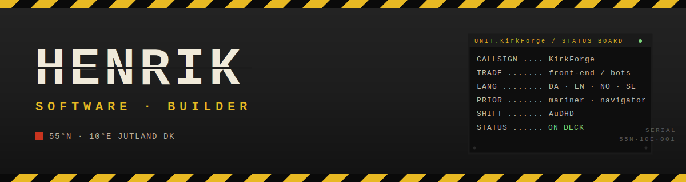
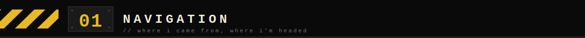
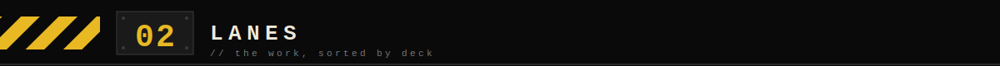
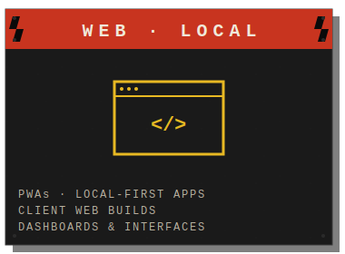
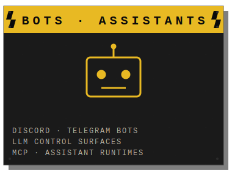
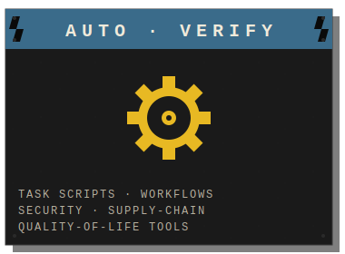
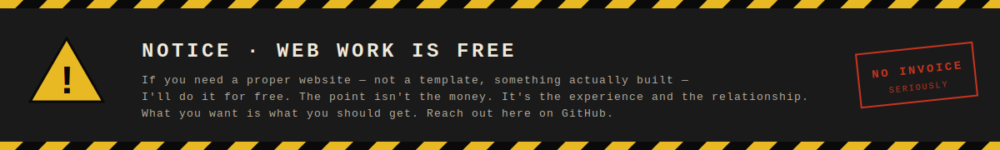
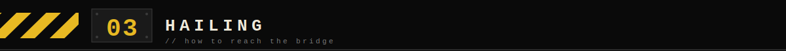
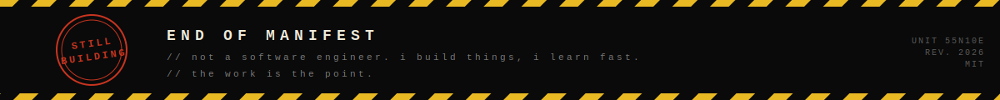

  

 
n

Software builder from Denmark.
Ex-mariner. Local-first tools, bots, automation, and weird practical systems.

Years on Danish-flagged vessels — navigator and deckhand on supply ships,
rescue vessels, and hopper dredgers. Now I build software.

I'm early in my software career, but I build real things end-to-end:
interfaces, state, storage, tests, docs, automation, and the rough edges between them.

KirkForge started with a resurrected old laptop, a webchat assistant,
and too many late nights turning hardware pain into code.

AuDHD brain. Clear lanes or nothing gets done.

 
n

Everything lives under one username, but the work splits into three
so I (and you) can actually find things:

<table>
<tr>
<td width="33%" align="center"></td>
<td width="33%" align="center"></td>
<td width="33%" align="center"></td>
</tr>
</table>

 
n

Most of my larger experiments live private while they are still rough:
assistant runtimes, local-first dashboards, supply-chain/security tools,
Discord/LLM control surfaces, and strange little systems with memory.

Some are polished. Some are shipyard scrap.
The pattern is the same: useful tools with personality, provenance, and control.

 
n

Web builds are free — I learn by shipping. Bots and automation
start at **$10–13**; scope scales from there.

Nordic translation (Danish, Swedish, Norwegian), code tasks, data entry.
Danish voice work too — North Zealand and Jutland accents. Long story.

 
n

Reach me here on GitHub. Open an issue on any repo, or DM me. Danish, English, Norwegian, or Swedish all work.

 
n

